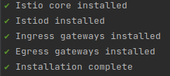
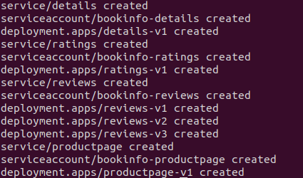
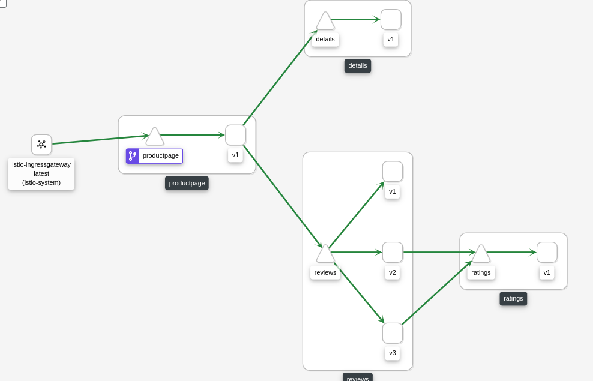

# Lab-Kubernetes-Istio

## Kubernetes

## Istio

Firstly let's describe what a service mesh is. It is a dedicated infrastructure layer, that can be easily added to the
application and provide functionalities like observability, traffic management and security out of the box. We don't
have to add any additional code by ourselves.

Istio is a service mesh. It also provides more complex capabilities and help with solving problems related to the rate
limiting, encryption, A/B testing etc.

### How does it work?

There are two main components:

#### Data plane

You can consider data plane as a huge number of envoy proxies which run alongside services running in K8s. They
intercept all the network traffic that was designed to reach the specific application.

#### Control plane

Control plane, checks the desired configuration and dynamically updates the proxy servers according to the specified
rules.

## Tutorial

## Exercise

For the exercise, we will be using the default application and the default tutorial provided by the Istio team.

### Installation

Istio installation can be found on the site: https://istio.io/latest/docs/setup/getting-started/

Minikube installation: https://minikube.sigs.k8s.io/docs/start/

#### Step 1

Run command
``
minikube start
``
to start Your cluster

#### Step 2

Run command
``
istioctl install --set profile=demo -y
``
to set the profile to demo, so that the demo profile is used, and we can use defaults for the application. Also this
profile enables high level of tracing and access logging. As the result, You should something similar to this:



#### Step 3

Run command
``
kubectl label namespace default istio-injection=enabled
``
to set automatic injection of envoy side proxies.

#### Step 4

Run command
``
kubectl apply -f samples/bookinfo/platform/kube/bookinfo.yaml
``
in the istio directory(make sure that You run the correct path).



✔ No validation issues found when analyzing namespace: default.

#### Step 5

Create gateway and the destination rules
``
kubectl apply -f samples/bookinfo/networking/bookinfo-gateway.yaml kubectl apply -f samples/bookinfo/networking/destination-rule-all.yaml
``

#### Step 6

Verify that all the services running in the kube
``
kubectl get services
``


#### Step 7

Verify that everything works from the istio side
``
istioctl analyze
``

✔ No validation issues found when analyzing namespace: default.

#### Step 8

Verify that You can access productpage: We need the host, and the port for the gateway:

In another terminal, run

````
minikube tunnel
````

And in the current one, run:

````
export INGRESS_PORT=$(kubectl -n istio-system get service istio-ingressgateway -o jsonpath='{.spec.ports[?(@.name=="http2")].nodePort}')
export INGRESS_HOST=$(minikube ip)
export GATEWAY_URL=$INGRESS_HOST:$INGRESS_PORT

echo "http://$GATEWAY_URL/productpage"
````

You should see the reviews on the URL.

#### Step 9

We will install kiali - dashboard for istio

```
kubectl apply -f samples/addons/kiali.yaml
kubectl rollout status deployment/kiali -n istio-system
istioctl dashboard kiali
```

### Real task

If You reach this point, You should be able to both reach the kiali dashboard, and see the product page of the system.
Kiali is useful tool to visualize the whole graph of our microservices in the cluster. Architecture of the services
which we will be using.



As You can see, we have 3 versions of the review app, v1 -> without any stars, v2 -> with black stars and v3 with red
stars.

#### Task 1 Simulate Deployment and weighted rerouting of people

Create Virtual Service which will update the user routing for all the users which login start with Your initials.
Configuration for the user routing:

- around 9 per 10 requests should be routed to the reviews with the version v2
- other requests should be routed to the version with the v1
- other users are unaffected
- specify the timeout that envoy proxy should wait for replies to the 15s
- specify amount of the replies, so that it will try to retry the call 5 times, each with a 5 second timeout

Solution put in the file exercise/user-routing.yaml and apply it to the cluster. Then apply it to the cluster and verify
whether it works.

HINT: header _end-user_ is sent all the time with the login of the user. Add the http match for this header.

#### Task 2 Testing Fault Tolerance

Use the file which You have prepared for the previous task. Extend it by adding the 20s delay for half of the requests
to the ratings for You.

Then verify that sometimes, Your application receives an error fetching product reviews.

#### DIY Task 3 Traffic Mirroring

Using the file that You have already configured testing and fault tolerance for the application, mirror all the logs to
the version v3. Verify logs from the application to check whether they reach the version v3.

Important:

Do not expect that You will see ratings with the red stars. Mirroring of the traffic is done with the fire and forget
method, so all the responses are discarded.

## Solution and Ideas

Solution file are presented in the solution directory.

### Task 1 Simulate Deployment and weighted rerouting of people

In this task, You had learned how easy it is to reroute specific calls to the appropriate services. Imagine situation,
where You are trying to deploy the new version of Your microservice. You can easily specify which users, and how often
are they using new version. What is more, as You see, You can even specify different amount of retries and timeouts for
the new version. Then If You are happy with the testing, You can easily remove the matching and move all the users to
the new microservice.

### Task 2 Testing Fault Tolerance

In this task, You had learned that, we can easily check, what could happen if there would be any timeout in our
application. We could even observe on the frontend, whether the appropriate error message is shown. Also, we can
instantly shift the traffic to other versions of application just as in the task 1.

### DIY Task 3 Traffic Mirroring

In huge, enterprise application, testing Your microservices, just as the user would use them is a huge benefit for the
company. Therefore, preparing out of the box traffic mirroring to the new microservices, it's a huge advantage. By using
that, we can easily make sure that all the requests that are being made to the testing environment with the new version
are tested, and we can generate test suites based on them. What is more, we can easily monitor everything that is
happening in our cluster and make sure that no strange requests occur without affecting production environment.